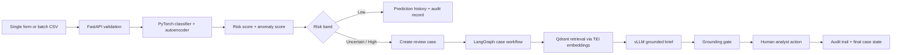

# Fraud Sentinel

Deployment-ready COMP263 final project: credit-card fraud detection with a PyTorch model, FastAPI inference service, SvelteKit dashboard, LangGraph case-review workflow, RAG-grounded analyst briefs, Prometheus metrics, and Flux/Kustomize manifests for a Talos k3s platform.

- Live app: [fraud.lintellabs.net](https://fraud.lintellabs.net)
- Deep learning repo landing page: [COMP 263 README](../../README.md)
- Diagram source folder: [docs/diagrams](./docs/diagrams/)

The LLM never decides fraud. The PyTorch model scores the transaction. The system routes uncertain or high-risk cases into review, and the human analyst records the final review action.

## What It Builds

| Layer | Technology | Purpose |
| --- | --- | --- |
| Model | PyTorch | Dense fraud classifier plus autoencoder anomaly signal |
| API | FastAPI | Prediction, batch upload, history, cases, reviews, health, metrics |
| Agent | LangGraph | Durable high-risk case review with human approval gates |
| RAG | TEI + Qdrant + vLLM | Grounded analyst brief from model and policy documents |
| UI | SvelteKit | Scoring, CSV upload, history, case queue, and review actions |
| Data | Kaggle credit card fraud dataset | Real historical fraud data for training and evaluation |
| Storage | Postgres | Predictions, cases, model registry, reviews, and audit events |
| GitOps | Kustomize + Flux | Talos k3s deployment package |
| Exposure | Cloudflare Tunnel | Public hostname for live demo access |
| Observability | Prometheus + Grafana | API, model, case, and agent metrics |

## System Flow

Mermaid source: [prediction-flow.mmd](./docs/diagrams/prediction-flow.mmd)



## Diagram Index

| Diagram | What it covers |
| --- | --- |
| [platform-overview.mmd](./docs/diagrams/platform-overview.mmd) | End-to-end platform topology across UI, API, agent, storage, and shared services |
| [prediction-flow.mmd](./docs/diagrams/prediction-flow.mmd) | Single-transaction scoring and case creation pipeline |
| [batch-upload-flow.mmd](./docs/diagrams/batch-upload-flow.mmd) | CSV upload, row validation, accepted rows, and rejected rows |
| [model-training.mmd](./docs/diagrams/model-training.mmd) | Kaggle data download, training, thresholds, metrics, and artifact publishing |
| [agent-case-review.mmd](./docs/diagrams/agent-case-review.mmd) | LangGraph load, route, retrieve, brief, pause, resume, and finalize flow |
| [human-review-states.mmd](./docs/diagrams/human-review-states.mmd) | Case states and analyst review transitions |
| [observability-and-data.mmd](./docs/diagrams/observability-and-data.mmd) | Metrics, audit tables, and data movement |
| [gitops-deployment.mmd](./docs/diagrams/gitops-deployment.mmd) | Dockerfiles, GHCR, Flux, Talos, PVCs, and Cloudflare exposure |

## Deployment And Hosting

Fraud Sentinel is hosted as a multi-service Kubernetes application, not as a single local script.

1. Source code in this repository defines the frontend, API, trainer, agent workflow, and manifests.
2. Dockerfiles build OCI images for the UI, API, and trainer.
3. Those images are published to GHCR.
4. Flux applies the Kustomize overlay to the Talos k3s cluster.
5. The trainer `Job` downloads the Kaggle dataset, trains the model, and writes versioned artifacts to the `fraud-model-artifacts` PVC.
6. The API mounts the artifact PVC and only becomes ready when a valid model bundle exists.
7. The SvelteKit UI is exposed through a named Cloudflare Tunnel at [fraud.lintellabs.net](https://fraud.lintellabs.net).

Mermaid source: [gitops-deployment.mmd](./docs/diagrams/gitops-deployment.mmd)

## What The Dockerfiles Actually Do

- `backend/Dockerfile`: builds the FastAPI runtime image that loads model artifacts and serves the API.
- `backend/Dockerfile.trainer`: builds the training image that installs the full PyTorch and ML stack for Kaggle download, model training, and artifact generation.
- `frontend/Dockerfile`: builds the SvelteKit UI image.

The Dockerfiles are build recipes. GHCR stores the resulting OCI images. Kubernetes pulls and runs those images on the cluster.

## Local Development

```bash
cd "Fina project/fraud-sentinel"
python3.12 -m venv .venv
source .venv/bin/activate
pip install -e ".[dev]"
```

Run the API after model artifacts exist:

```bash
export FRAUD_MODEL_DIR=./artifacts/model
uvicorn fraud_sentinel.api.main:app --app-dir backend --reload
```

Train from an existing Kaggle CSV:

```bash
python -m fraud_sentinel.cli.train \
  --csv data/creditcard.csv \
  --output-dir artifacts/model \
  --min-pr-auc 0.70 \
  --min-recall 0.80
```

Download and train through Kaggle credentials:

```bash
export KAGGLE_USERNAME="..."
export KAGGLE_KEY="..."
python -m fraud_sentinel.cli.train --download-if-missing --output-dir artifacts/model
```

Run the SvelteKit UI:

```bash
cd frontend
npm install
npm run dev
```

## Deployment Shape

The Talos overlay assumes existing platform services are reachable through internal DNS and credentials are supplied by a SOPS-managed Secret:

```bash
kustomize build k8s/overlays/talos
```

Key deployment properties:

- trainer jobs request `nvidia.com/gpu: "1"` for the 3090 node
- model artifacts are written to `fraud-model-artifacts`
- upload scratch and exports use a PVC-backed storage path
- API readiness stays false until artifacts are present
- Cloudflare named tunnel traffic terminates at `fraud-ui`

For the live tunnel and cutover process, see [docs/deployment-runbook.md](./docs/deployment-runbook.md).

## UI Design Handoff

For product and design constraints, see [docs/ui-design-handoff.md](./docs/ui-design-handoff.md). It explains the prediction workflow, batch workflow, case-review workflow, demo uses, and design guardrails without locking the interface into one visual style.

## Test Suites

```bash
PYTHONPATH=backend python3 -m unittest discover backend/tests
python3 -m py_compile ci/e2e_api.py
bash -n ci/smoke_cluster.sh
./ci/smoke_cluster.sh
```

Use `REQUIRE_MODEL_READY=true ./ci/smoke_cluster.sh` after the Kaggle trainer has produced model artifacts. Before training, the smoke suite verifies the expected not-ready state instead of failing the deployment.

## Gates

| Gate | What must pass |
| --- | --- |
| G1 Data | Kaggle schema valid, class imbalance reported, no target leakage |
| G2 Model | PR-AUC, recall, precision, F1, confusion matrix, thresholds generated |
| G3 API | Prediction, batch upload, history, case creation, review, health, metrics |
| G4 Agent | Risk routing, RAG retrieval, grounding gate, human interrupt and resume |
| G5 UI | Prediction form, CSV upload, history, case queue, case review |
| G6 Deploy | Images build, manifests validate, pods ready, metrics scraped |

## Possible Upgrades

- replace static threshold tuning with analyst-tunable threshold controls and drift reporting
- add richer batch analytics with per-column validation summaries and downloadable review packs
- introduce Cloudflare Access or another identity layer in front of the public demo hostname
- add event-driven case notifications through NATS instead of relying only on pull-based review queues
- add richer model registry version comparison in the UI so new artifacts can be compared before promotion
- extend the RAG corpus with curated fraud policy and operations content beyond the initial local document set
