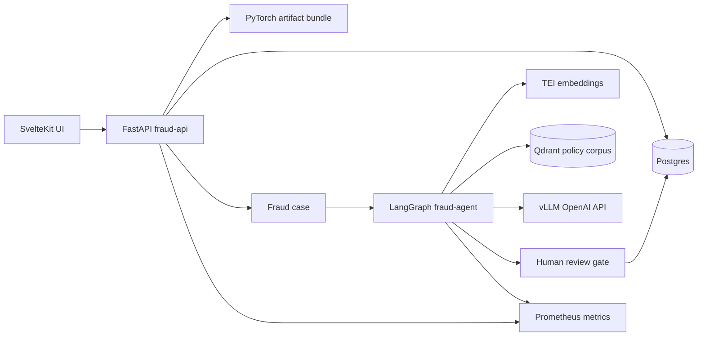

# Architecture

The hot prediction path is deterministic and model-driven. Agentic review is triggered only for high-risk or uncertain cases, where durable state, RAG retrieval, grounding checks, and human review add operational value.

