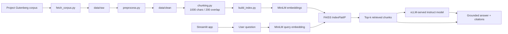

# COMP 263 — Deep Learning

**Student:** Izzet Abidi (300898230)
**Program:** Artificial Intelligence — Software Engineering Technology (AI-SET)
**Institution:** Centennial College — Winter 2026

---

## Repository Overview

This repository contains all graded lab assignments for COMP 263: Deep Learning. Each assignment builds on foundational concepts introduced in earlier weeks, progressing from spatial feature extraction through sequential modeling, generative architectures, and retrieval-augmented generation.

## Assignment Map

| Assignment | Topic | Core Technique | Status |
|:----------:|-------|----------------|:------:|
| [1](Assign1/) | Fashion MNIST Classification | CNN + RNN (LSTM) | Complete |
| [2](Assign2/) | Autoencoders & Transfer Learning | Denoising Autoencoder + Encoder Transfer | Complete |
| [3](Assign3/) | Variational Autoencoders | VAE with Reparameterization + Latent Space Visualization | Complete |
| [4](Assign4/) | Retrieval-Augmented Generation | MiniLM Embeddings + FAISS + vLLM + Streamlit | Evaluation Pending |

## Course Progression

```
Assignment 1          Assignment 2          Assignment 3          Assignment 4
CNN + RNN (LSTM)      Autoencoder +         Variational           RAG over public-domain
                      Transfer              Autoencoder           literature
───────────────────► ───────────────────► ───────────────────► ───────────────────
Spatial feature       Unsupervised          Probabilistic         Retrieval from
extraction via        feature learning      latent space with     chunked text using
convolution layers    via denoising         KL divergence         MiniLM embeddings
    +                 autoencoder               +                     +
Sequential modeling       +                 Reparameterization    FAISS vector search
via LSTM hidden       Encoder transfer      trick for sampling        +
states on image rows  to supervised CNN         +                 Context-only
                      on 3K labels          Latent grid           generation through
                                            generation            local vLLM + UI
```

**Assignment 1** establishes the baseline for deep learning classification by comparing two fundamentally different architectures on the same dataset. Convolutional Neural Networks exploit spatial locality through learned filter kernels, while Recurrent Neural Networks (LSTM) process image rows as temporal sequences. Training both on Fashion MNIST reveals how architectural inductive biases shape learning dynamics, convergence speed, and generalization.

**Assignment 2** introduces unsupervised pretraining and transfer learning. A denoising autoencoder learns robust feature representations from 57,000 unlabeled Fashion MNIST images by reconstructing clean outputs from Gaussian-corrupted inputs. The encoder weights then transfer to a supervised CNN classifier operating on just 3,000 labeled samples, demonstrating how pretraining compensates for limited labeled data. The baseline CNN (73.17% test accuracy) and pretrained CNN (71.17% test accuracy) are compared side-by-side to analyze the impact of transfer learning under data-scarce conditions.

**Assignment 3** transitions from deterministic autoencoders to probabilistic generative modeling. A Variational Autoencoder maps Fashion MNIST images to a 2D latent probability distribution parameterized by learned mean and log-variance vectors. The reparameterization trick enables gradient-based optimization through the stochastic sampling node, while KL divergence regularization shapes the latent space into a smooth Gaussian manifold. The trained decoder generates novel images from a 10×10 quantile grid, and a 2D scatter plot of the test set's latent encodings reveals how the VAE organizes garment categories across the learned manifold.

**Assignment 4** moves from model training to retrieval-augmented generation. A custom RAG pipeline downloads six public-domain books from Project Gutenberg, strips boilerplate, chunks the text, embeds passages with Sentence-Transformers, and stores normalized vectors in FAISS for cosine retrieval. A Streamlit app lets users ask questions, filter results by author, inspect retrieved chunks, and generate context-grounded answers through a locally served vLLM endpoint.

## Assignment 4 Pipeline

The Assignment 4 app is documented in more detail in [Assign4/README.md](./Assign4/README.md). The same Mermaid source is also stored in [Assign4/mermaid.mmd](./Assign4/mermaid.mmd).



## Assignment 4 Scalability Notes

The current RAG implementation is a clean baseline for a six-book corpus, but it is not designed for large-scale production search. The main scaling constraints are exact FAISS search, whole-index loading in one process, simple post-filtering by author, and character-based chunking that is not aware of chapter or section boundaries.

Reasonable upgrade paths:

- **Structured chunking:** split by chapter, heading, or aphorism before applying overlap. This keeps source boundaries cleaner than plain character windows.
- **Semantic chunking:** if your professor meant semantic chunking, the next step is using embedding or similarity-based boundary detection rather than only recursive separators.
- **Hybrid retrieval:** combine dense retrieval with BM25 or keyword retrieval for stronger recall on names, quotes, and exact phrases.
- **Reranking:** add a lightweight cross-encoder reranker after FAISS retrieval to improve final context quality without changing the corpus format.
- **Approximate search:** replace exact `IndexFlatIP` with an ANN strategy such as IVF or HNSW when the corpus grows beyond laptop-sized exact search.
- **Operational scaling:** separate preprocessing, indexing, retrieval, and generation into independent services so the UI is not responsible for the whole pipeline lifecycle.

## Technology Stack

| Library | Version | Usage |
|---------|---------|-------|
| TensorFlow / Keras | 2.x | Model building, training, evaluation |
| NumPy | 1.x | Array operations, pixel normalization |
| Matplotlib | 3.x | Training curves, image visualization, probability histograms |
| Seaborn | 0.x | Confusion matrix heatmaps |
| scikit-learn | 1.x | Train/validation splitting, confusion matrix computation |
| SciPy | 1.x | Standard normal quantile (PPF) for latent grid generation |
| Sentence-Transformers | 3.x | Text embeddings for Assignment 4 RAG retrieval |
| FAISS | 1.x | Vector index for Assignment 4 semantic search |
| vLLM | Latest compatible | Local OpenAI-compatible LLM serving for Assignment 4 |
| Streamlit | 1.x | Interactive Assignment 4 RAG interface |

## Quick Start

```bash
# Clone the repository
git clone https://github.com/ixxet/COMP263-Deep-Learning.git
cd COMP263-Deep-Learning

# Install dependencies
pip install tensorflow numpy matplotlib seaborn scikit-learn scipy

# Run Assignment 1
python Assign1/izzet_linear.py

# Run Assignment 2
python Assign2/izzet_lab2.py

# Run Assignment 3
python Assign3/izzet_lab3.py

# Run Assignment 4
cd Assign4
python -m venv .venv && source .venv/bin/activate
pip install -r requirements.txt
python -m src.fetch_corpus
python -m src.preprocess
python -m src.build_index
# Start vLLM in another terminal before launching the app
streamlit run app.py
```
