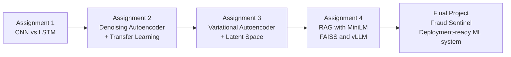

# COMP 263 — Deep Learning

**Student:** Izzet Abidi (300898230)  
**Program:** Artificial Intelligence — Software Engineering Technology (AI-SET)  
**Institution:** Centennial College — Winter 2026

## Repository Overview

This repository contains the full COMP 263 progression: four graded assignments plus the final deployed project. The work starts with core supervised learning, moves through representation learning and generative modeling, then into retrieval-augmented generation, and ends with a production-style fraud detection platform deployed on Kubernetes.

## Assignment Map

| Milestone | Topic | Core Technique | Deliverable | Status |
| --- | --- | --- | --- | --- |
| [Assignment 1](./Assign1/) | Fashion MNIST classification | CNN + RNN (LSTM) | Comparative image classifier | Complete |
| [Assignment 2](./Assign2/) | Autoencoders and transfer learning | Denoising autoencoder + encoder reuse | Pretraining and low-label classifier | Complete |
| [Assignment 3](./Assign3/) | Variational autoencoders | VAE + reparameterization + latent visualization | Generative latent-space model | Complete |
| [Assignment 4](./Assign4/) | Retrieval-augmented generation | MiniLM embeddings + FAISS + vLLM + Streamlit | Local RAG application | Complete |
| [Final Project: Fraud Sentinel](./Fina%20project/fraud-sentinel/README.md) | Deployment-ready fraud detection | PyTorch + FastAPI + SvelteKit + LangGraph + RAG + GitOps | Live deep-learning platform | Live / Deployed |

## Course Progression

## What Each Stage Added

### [Assignment 1](./Assign1/)

- Built and compared a CNN and an LSTM on the same Fashion MNIST classification task.
- Learned how architecture choice changes convergence, feature extraction, and classification behavior.
- Established the baseline for supervised deep-learning evaluation.

### [Assignment 2](./Assign2/)

- Trained a denoising autoencoder on unlabeled Fashion MNIST images.
- Reused the encoder weights in a supervised classifier with limited labeled data.
- Explored when unsupervised pretraining helps and where it falls short.

### [Assignment 3](./Assign3/)

- Implemented a VAE with learned mean and log-variance.
- Used the reparameterization trick and KL regularization to shape a smooth latent manifold.
- Visualized the learned latent space and generated new samples from it.

### [Assignment 4](./Assign4/)

- Built a local RAG pipeline over public-domain literature.
- Embedded chunked passages with Sentence-Transformers, indexed them in FAISS, and generated grounded answers with vLLM.
- Moved from model training to retrieval, context assembly, and application serving.

### [Final Project: Fraud Sentinel](./Fina%20project/fraud-sentinel/README.md)

- Trained a PyTorch fraud classifier and anomaly model on the Kaggle credit card fraud dataset.
- Exposed scoring through a FastAPI service and analyst dashboard.
- Added LangGraph case orchestration, RAG-grounded analyst briefs, human review gates, audit history, Prometheus metrics, and Talos/k3s deployment manifests.
- Deployed the live system behind Cloudflare at [fraud.lintellabs.net](https://fraud.lintellabs.net).

## Final Project Links

| Resource | Link |
| --- | --- |
| Project landing page | [Fraud Sentinel README](./Fina%20project/fraud-sentinel/README.md) |
| Live deployment | [fraud.lintellabs.net](https://fraud.lintellabs.net) |
| Pipeline and platform diagrams | [docs/diagrams](./Fina%20project/fraud-sentinel/docs/diagrams/) |
| Prediction workflow diagram | [prediction-flow.mmd](./Fina%20project/fraud-sentinel/docs/diagrams/prediction-flow.mmd) |
| Deployment workflow diagram | [gitops-deployment.mmd](./Fina%20project/fraud-sentinel/docs/diagrams/gitops-deployment.mmd) |
| Training workflow diagram | [model-training.mmd](./Fina%20project/fraud-sentinel/docs/diagrams/model-training.mmd) |

## Skills Built Across The Course

| Area | Built Through |
| --- | --- |
| Supervised deep learning | Assignment 1 CNN and LSTM training, evaluation, and comparison |
| Representation learning | Assignment 2 denoising autoencoder and encoder transfer |
| Generative modeling | Assignment 3 VAE, KL regularization, latent sampling, and visualization |
| Retrieval systems | Assignment 4 chunking, embeddings, FAISS search, and grounded generation |
| Deployment-ready ML systems | Final Project API design, artifact management, human review workflow, observability, and Kubernetes GitOps |

## Repository Entry Points

| Folder | Purpose |
| --- | --- |
| [Assign1](./Assign1/) | Assignment 1 code and report material |
| [Assign2](./Assign2/) | Assignment 2 code and report material |
| [Assign3](./Assign3/) | Assignment 3 code and report material |
| [Assign4](./Assign4/) | Assignment 4 RAG application and documentation |
| [Fina project/fraud-sentinel](./Fina%20project/fraud-sentinel/README.md) | Final project source, manifests, docs, and tests |

## Running The Work

Use each assignment's own README for setup details. The final project has its own application landing page and deployment notes under [Fraud Sentinel README](./Fina%20project/fraud-sentinel/README.md).

- [Assignment 1 README](./Assign1/README.md)
- [Assignment 2 README](./Assign2/README.md)
- [Assignment 3 README](./Assign3/README.md)
- [Assignment 4 README](./Assign4/README.md)
- [Fraud Sentinel README](./Fina%20project/fraud-sentinel/README.md)
